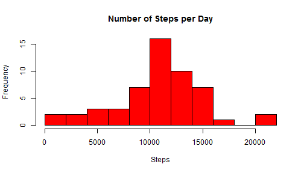
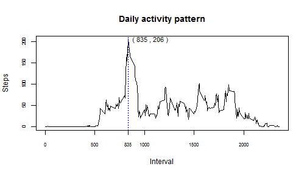
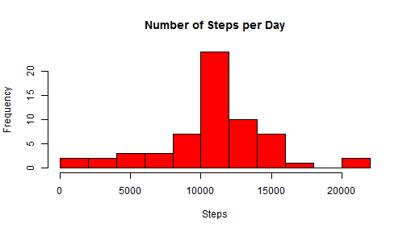
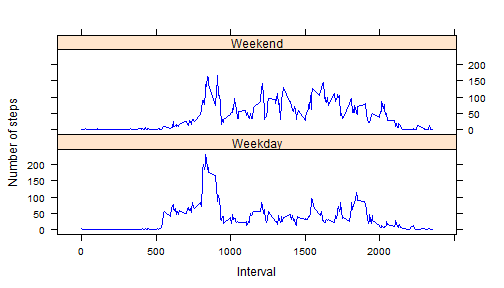

Programming Assignment 1 - Activity data
========================================================
Abhishek Panda

The objective of this assignment is to demonstrate the use of the **Knitr** package and the **R Markdown** feature.  

This assignment involves the following analyses on the [Activity Data set](https://d396qusza40orc.cloudfront.net/repdata%2Fdata%2Factivity.zip):
* Reporting the Mean total number of steps taken per day 
* Plotting the Average daily activity pattern
* Reporting differences in activity patterns between weekdays and weekends


Step1. Load Activity Data set into a Data table

```r
actDf <- read.csv("./ActivityData/activity.csv", header=TRUE, sep=",")
actDt <- data.table(df)
```

**Total number of steps taken per day**
---------------------------------------

Load the data into a Data Frame and sum up the number of steps taken per day. Then, remove all missing values.

```r
df <- sqldf("select date, sum(steps) as steps from actDf group by date")
steps_ <- df$steps
date_ <- df$date
plotDfok <- complete.cases(steps_,date_)
```

Plot a histogram for the number of steps per day

```r
hist(df[plotDfok,"steps"],xlab="Steps", main="Number of Steps per Day", col="red", breaks=15)
```



Report the Mean of the Total number of steps taken per day


```r
oldMean <- mean(df[plotDfok,"steps"])
oldMean
```

[1] 10766

Report the Median of the Total number of steps taken per day

```r
oldMed <- median(df[plotDfok,"steps"])
oldMed
```

[1] 10765

**Average Daily Activity pattern**
-----------------------------------
Plot the 5-minute interval (x-axis) and the average number of steps taken, averaged across all days (y-axis)

```r
summaryDf <- sqldf("select interval, avg(steps) as steps from actDf group by interval")
maxIntv <- as.numeric(summaryDf[summaryDf$steps==max(summaryDf$steps),"interval"])
maxSteps <- as.numeric(summaryDf[summaryDf$steps==max(summaryDf$steps),"steps"])

plot(summaryDf$interval,summaryDf$steps,type="l",xlab="Interval", ylab="Steps",main="Daily activity pattern", yaxt="n", xaxt="n")
abline(v=maxIntv, lty=3, col="blue", lwd=1)
axis(1,cex.axis=0.7)
axis(1,at = maxIntv, cex.axis=0.7)
axis(2,cex.axis = 0.7)
text(maxIntv, maxSteps, labels = paste("(",maxIntv,",",maxSteps,")"), cex= 0.9, offset = 0.5, pos= 4)
```



Report the 5-minute interval that, on average across all the days in the dataset, contains the maximum number of steps

```r
summaryDf[summaryDf$steps==max(summaryDf$steps),"interval"]
```

[1] 835

**Imputing Missing Values**
-----------------------------------

Report the number rows with one or more missing values in the dataset


```r
nrow(actDf[is.na(actDf$interval) | is.na(actDf$steps) | is.na(actDf$date),])
```

[1] 2304

Fill in Missing values:
1. Pick up the average value of the number of steps for an interval aross days  
2. If the value is still missing,  Pick up the average value of the number of steps for the concerned day


```r
fillDf <- actDf

for(i in 1:nrow(fillDf)) 
{
  if (is.na(fillDf[i,"steps"]))
    fillDf[i,"steps"] <- round(mean(actDf[!is.na(actDf$steps) & actDf$interval == fillDf[i,"interval"], "steps"]))
  
  if (is.na(fillDf[i,"steps"]))
    fillDf[i,"steps"] <-  round(mean(actDf[!is.na(actDf$steps) & actDf$date == fillDf[i,"date"], "steps"]))
  
}

print(paste("Rows Missing Values in the end - ",nrow(fillDf[is.na(fillDf$steps),])))
```

[1] "Rows Missing Values in the end -  0"

**Filled data** - Plot a histogram for the number of steps per day

```r
df <- sqldf("select date, sum(steps) as steps from fillDf group by date")
hist(df[,"steps"],xlab="Steps", main="Number of Steps per Day", col="red", breaks=15)
```



**Filled data** - Report the Mean of the Total number of steps taken per day


```r
newMean <- mean(df[plotDfok,"steps"])
newMean
```

[1] 10766

**Filled data** - Report the Median of the Total number of steps taken per day  

```r
newMed <- median(df[plotDfok,"steps"])
newMed
```

[1] 10765

**Filled data** - Compare the new Mean and Median with their previous Values

```r
print(paste("New Mean -", round(oldMean), "Old Mean",round(newMean)))
```

```
## [1] "New Mean - 10766 Old Mean 10766"
```

```r
print(paste("New Median -", round(oldMed), "Old Median",round(newMed)))
```

```
## [1] "New Median - 10765 Old Median 10765"
```

Difference in activity patterns between weekdays and weekends
-------------------------------------------------------------

Label rows as Weekdays or Weekends based on Date


```r
fillDf$WeekdayIndicator <- ifelse(weekdays(as.Date(fillDf$date)) %in% c("Saturday","Sunday"),"Weekend", "Weekday")
```

Plot the average Steps taken per interval during Weekdays and Weekends, separately.

```r
avgDf <- sqldf("select avg(steps) as steps, interval, WeekdayIndicator from fillDf group by interval, WeekdayIndicator")
avgDf <- transform(avgDf, WeekdayIndicator = factor(WeekdayIndicator))
xyplot(steps ~ interval | WeekdayIndicator, data=avgDf, layout=c(1,2),type="l", col="blue", ylab="Number of steps", xlab="Interval")
```



